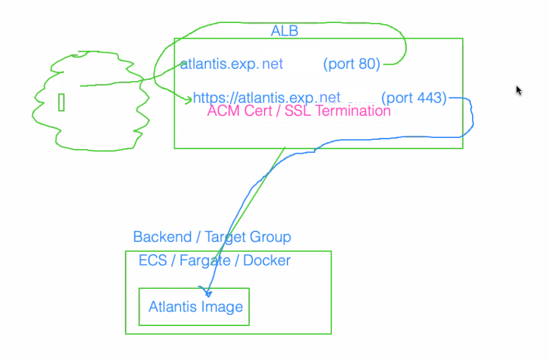
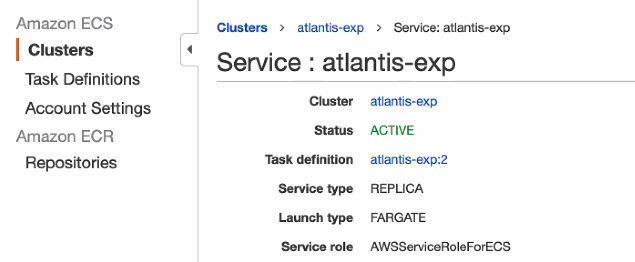
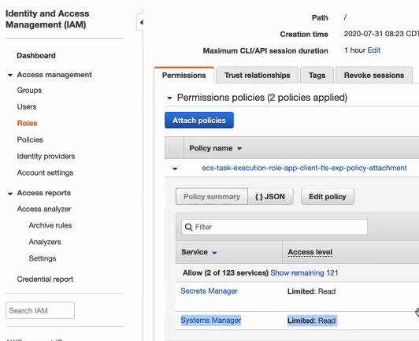

# [Terraform](README.md) / Atlantis

## Step-by-Step Atlantis Implementation

### Contextual Planning

### Step 1: Know the Options

In deciding how to implement Atlantis in our project's context, let's first take a moment to step back and remind ourselves what Atlantis is and what it does. Atlantis is ["a simple Go app. It receives webhooks from our Git host and executes Terraform commands locally."](https://www.runatlantis.io/docs/deployment.html#architecture-overview) It's high-level infrastructure middleware.

Although we certainly do not have to make concrete decisions on all implementation facets before we begin , we should take some time to get familiar with our options regarding

1. How to **configure** the Atlantis server, and
1. How to **integrate** Atlantis' resources into our existing structure

#### Configuration

As of the time of this publication, there are [3 ways to configure Atlantis](https://www.runatlantis.io/docs/configuring-atlantis.html). Step one is looking at our own configuration and deciding which way to implement our Atlantis server. The [Atlantis docs](https://www.runatlantis.io/docs/server-configuration.html) summarize our options:

```text
Configuration to atlantis server can be specified via command line flags, environment variables, a config file or a mix of the three.
```

In the [legendary waddle](https://github.com/trussworks/legendary-waddle) repo, for example, we used a combination of [environment variables](https://github.com/trussworks/legendary-waddle/blob/master/trussworks-prod/atlantis-prod/main.tf#L85-L102) and [repo-level `atlantis.yaml` files](https://github.com/trussworks/legendary-waddle/blob/master/atlantis.yaml).

#### Integration

This tutorial covers using the [Atlantis Fargate module](https://tf-registry.herokuapp.com/modules/terraform-aws-modules/atlantis/aws/latest) to deploy Atlantis. As we can see [in the documentation](https://tf-registry.herokuapp.com/modules/terraform-aws-modules/atlantis/aws/latest#modules), this module leverages a variety of other modules, submodules, and direct resource calls in our code to create the following key components:

- [Virtual Private Cloud (VPC)](https://registry.terraform.io/modules/terraform-aws-modules/vpc/aws/latest) and the accompanying [EC2-VPC security group](https://registry.terraform.io/modules/terraform-aws-modules/security-group/aws/latest)
- [SSL certificate using Amazon Certificate Manager (ACM)](https://registry.terraform.io/modules/terraform-aws-modules/acm/aws/latest)
- [Application Load Balancer (ALB)](https://registry.terraform.io/modules/terraform-aws-modules/alb/aws/latest) and submodules for [https 443](https://registry.terraform.io/modules/terraform-aws-modules/security-group/aws/latest/submodules/https-443) and [http 80](https://registry.terraform.io/modules/terraform-aws-modules/security-group/aws/latest/submodules/http-80)
- Domain name using [AWS Route53](https://registry.terraform.io/providers/hashicorp/aws/latest/docs/resources/route53_record) which points to ALB
- AWS [Elastic Cloud Service (ECS)](https://registry.terraform.io/modules/terraform-aws-modules/ecs/aws/latest), and [AWS Fargate running Atlantis Docker image](https://github.com/cloudposse/terraform-aws-ecs-container-definition)
- AWS [Parameter Store](https://registry.terraform.io/providers/hashicorp/aws/latest/docs/resources/ssm_parameter) to keep secrets and access them in ECS task natively

If we've already got some of these resources created on our project, the module expects us to integrate them. If the resources don't exist, the Atlantis module (and submodules) will create those resources for us. Figuring out which of our project's pre-existing resources to integrate, and then which resources we should leverage the Atlantis module's calls to create is the first step. Here's a rough whiteboarded visual of the process. Some call it art:


The next step is to figure out _the order in which to create the resources we need_ so as to avoid/minimize interdependency conflicts with the pre-existing resources we must integrate. The order of operations for this is what makes using this Atlantis module a bit tricky, especially if we're not familiar with how to both troubleshoot the creation of the resources Atlantis requires **_and_** troubleshoot the interconnectedness of those resources.

However, as a general example, here are some tickets @rpdelaney shared from [CMS's EASi project](https://github.com/CMSgov/easi-app) in planning/implementing Atlantis:


After we've planned out our implementation, we're ready to begin.

### Step 2: Prep Work

This section contains prep work to highlight resources we will need before calling the Atlantis module. This section is not meant to be exhaustive, but is meant to highlight specific resources we may want to have before we call the module itself.

### Make sure we have an email

Make sure we've got an email we can associate with Atlantis to recieve notifications, etc. On milmove we were able to associate our pre-existing `dp3.us` email address and use `dp3-integrations+atlantis@truss.works` to associate with the Atlantis role created in the next step.

### Generate a GitHub Deploy Key

Generate a new SSH key per [GitHub's documentation](https://docs.github.com/en/github/authenticating-to-github/generating-a-new-ssh-key-and-adding-it-to-the-ssh-agent#generating-a-new-ssh-key).
Next, add the key as a [Deploy Key](https://docs.github.com/en/developers/overview/managing-deploy-keys#deploy-keys), following GitHub Docs. As we can see, the first step in the setup is to "Run the `ssh-keygen` procedure" on our server, which we did in the previous step. Note that the act of adding the deploy key is done in the GUI for the repo associated with the location we'd like to deploy Atlantis in. In our case, we're in `transcom/transcom-infrasec-gov` because we're deploying to the `exp` account first. Go to the repo and click on Settings, then "Deploy keys". We'll click the box to "Allow write access."

`cat` our `id_ed25519.pub` to see our public key. It will look something like `ssh-ed25519 AAAAC3NzaC1lZDI1NTE5AAAAIErcI6OvZmjDqdzucoaLEndRx2DWfPVUKR9aF27ijH6V dp3-integrations+atlantis@truss.works`
After we add the deploy key to GitHub, we should get an automated email to confirm the key was added.

#### Store the Key in AWS SSM

Log into the console for the account we want to deploy Atlantis in the correct location (in our case, `transcom-gov-milmove-exp`), and add our key to AWS Systems Manager > Parameter Store with the name `/atlantis-global/atlantis_key` as type `SecureString`, using "My current account" as the KMS key source.

#### Set up Docker

Because we use already use our own base Docker image on MilMove, we're continuing the established pattern to deploy Atlantis. We'll create a docker image for Atlantis and put that image in ECR with all our other images. Next, we can create (and define) an ECS task to retrieve our Atlantis image from ECR. This way, we can require our Atlantis user to operate using our specific desired conditions.

The module creates the task and the role.

Make a dockerfile that runs inside the base circleci image. we'll need to install Terraform and Atlantis. Because our setup requires us to run docker-in-docker, we'll need to run the install as `USER root`, and then switch back to `USER circleci` after the install to be compatible with our base image.
See [this PR](https://github.com/transcom/circleci-docker/pull/98) for the implementation.

If we do not set the `atlantis_image` variable, we'll find `atlantis:latest` is used by default. This default is not recognized as updated when a new "latest" is released due to the word remaining unchanged. Therefore, we recommend we pass in a numbered version of the Atlantis docker image to the `atlantis_image` var.

### Directory Setup & Creating the Atlantis IAM role

Create an `atlantis-global` directory in our desired account:
`mkdir -p transcom-gov-milmove-exp/atlantis-global`

BUCKET: Add the bucket, version, and provider files following the steps (more or less) done in the bootstrapping document in [the Atlantis section](https://github.com/trussworks/legendary-waddle/blob/master/docs/how-to/bootstrap-new-aws-account.md#atlantis).

The official docs recommend [creating a dedicated user](https://www.runatlantis.io/docs/access-credentials.html#create-an-atlantis-user-optional), but in our case this isn't necessary.

TODO: add note explaining why we do this differently from circleci (and need only roles but not a user). At this point we can go ahead and add the `atlantis.yaml` with a list of directories Atlantis needs to access, and [update the PR](https://github.com/transcom/transcom-infrasec-gov/pull/275) template to include the new directory.

TODO: Add note about atlantis.yaml & repo config. Link to legendary-waddle examples and/or pull in milmove examples.

### Add & validate a certificate for Atlantis

Add a certificate to ACM, which [manages our certificates for us](https://github.com/transcom/transcom-infrasec-gov/pull/279). If we're using GovCloud, note that we can't create Route53 records in GovCloud. As a result, we'll need to:

1. Create _the certificate_ in GovCloud using the [`aws_acm_certificate` resource](https://registry.terraform.io/providers/hashicorp/aws/latest/docs/resources/acm_certificate)
1. Export the values as an output in the `output.tf` file like so:

    ```hcl
    output "atlantis_cert_validation" {
      description = "Map of data for atlantis. cert validation"
      value       = aws_acm_certificate.acm_atlantis_external.domain_validation_options
    }
    ```

    Once we've merged the PR, we'll have the cert validation output value to validate the certificate in the next step.

1. Validate the Route53 DNS records in the Commercial account using the [`aws_acm_certificate` resource](https://registry.terraform.io/providers/hashicorp/aws/latest/docs/resources/route53_record).

We'll need to find the `arn` to plug it into the [atlantis module](https://registry.terraform.io/modules/terraform-aws-modules/atlantis/aws/latest) we'll call in the next step. We can find this in the console's Certificate Manager after merging the PR to add the certificate.


### Step 3: Call the [Atlantis module](https://registry.terraform.io/modules/terraform-aws-modules/atlantis/aws/latest)

1. In a PR that [looks like this](https://github.com/transcom/transcom-infrasec-gov/pull/277).

Which we'll need to either use `-target` to apply or apply several times to create resources in an order that respects their interdependency.

1. we'll also need to add a little code to pull in the token from AWS as data:

```hcl
data "aws_ssm_parameter" "github_user_token" {
  name = "/atlantis-global/atlantis_key"
}
```

1. Connect the Bucket:

Of all the things this module does, it **does not** create a logs bucket. The module itself has the expectation we will either create a new bucket or connect an existing one. In our example, we'll connect an existing logs bucket and ensure our permissions are correct.

Locate our existing logs bucket, presumably created using the `trussworks/logs/aws` module. We're just going to put logs in the bucket that already exists for the account, in our case `transcom-gov-milmove-exp-aws-logs`.

Once we find the code that creates the bucket, we need to give Atlantis permission to add our logs to the bucket. We do this by adding our chosen logs bucket prefix (we're following the established pattern and using `alb/atlantis-exp` here) to the `alb_logs_prefixes` and the `nlb_logs_prefixes` lists [in our existing logs bucket](https://github.com/transcom/transcom-infrasec-gov/blob/0eeba19465584e10772a9b1d1f71fb3e87d7138c/transcom-gov-milmove-exp/admin-global/main.tf#L25-L26).

After that, we seal the deal by returning to our code and adding the following code to our module call:

```hcl
alb_log_bucket_name             = "transcom-gov-milmove-exp-aws-logs"
alb_log_location_prefix         = "alb/atlantis-exp"
alb_logging_enabled             = true
alb_listener_ssl_policy_default = true
```

Another example is available in the [legendary-waddle repo](https://github.com/trussworks/legendary-waddle/blob/6b63fc65c6d2b0237a7233ad36cb9356f329966b/trussworks-prod/atlantis-prod/main.tf#L54-L56)

Then we can go into the console to check that the bucket contains the prefix path by viewing the auto-created `ELBAccessLogTestFile` under the path we indicated, in our case `alb/atlantis-exp/`:


### Step 4: Troubleshooting

Due to some bugs in the module and the inherent complexity of integrating/setting up so many resources, some degree of troubleshooting will be necessary. Thus it's included here as a step.

### ACM/Certificate Troubleshooting

We'll get a 503 connection refusal error if our certs aren't set up correctly:


If we get a cert error when we look at our chosen (in our case `atlantis.exp.move.mil`):


Check the records and corresponding IP addresses in the terminal using `dig move.mil` and `host atlantis.move.mil` to pull up our ACM associated values. Here we also check `orders.exp.move.mil` (corresponding to our misaligned certificate), but it looks similar to this:


We can also look at this in Route 53 > Hosted zones check record name --> and look at the `Value/Route traffic to` column. The value should not be going to an IP, it should be going to a CNAME.

We troubleshoot by logging into the console, looking at our ALB, and checking what's associated with it:
EC2 > load balancer > `atlantis-exp`


Click on our cert and do a manual hack to point to the load balancer.

(**TODO**: don't forget to import notes from the PR into here, specifically that part where I had to use subnet ids instead of straight up string values for the subnets)

### ALB Troubleshooting

We'll see two ALB listeners in the plan related to the redirect on the ALB. Take note bc this hot mess might cause problems later:

```hcl
  # module.atlantis.module.alb.aws_lb_listener.frontend_http_tcp[0] will be created
  ...blah...blah...blah...
      + port              = 80
      + protocol          = "HTTP"
      + ssl_policy        = (known after apply)

...blah...blah...blah...{{

          + redirect {
              + host        = "#{host}"
              + path        = "/#{path}"
              + port        = "443"
              + protocol    = "HTTPS"
              + query       = "#{query}"
              + status_code = "HTTP_301"
            }
        }
    }

  # module.atlantis.module.alb.aws_lb_listener.frontend_https[0] will be created
  + resource "aws_lb_listener" "frontend_https" {
  ...blah...blah...blah...
      + port              = 443
      + protocol          = "HTTPS"
      + ssl_policy        = "ELBSecurityPolicy-2016-08"

      + default_action {
          + order            = (known after apply)
          + target_group_arn = (known after apply)
          + type             = "forward"
        }
    }
```

Check out those ports because this is what's happening:


The ALB is being created with these two listeners (one https & one tcp). The tcp port (on 80) serves to redirect to https/443 to force use of our ACM cert we created & sets up SSL termination. This keeps us from having to jump through the hoops of setting up docker and the client with certs and dealing with SSL termination the TCP way, which is much more of a PITA (and is also how we have to do it with NLBs).

Check that the Fargate instance is behind the ALB. If not we'll have to put it there manually in the console. We can do this by specifying the target group

### ECS Tasks Permissions Troubleshooting

We only had govcloud drama here. The module hard-codes `aws` as the provider but govcloud requires `aws-us-gov` to create the task policy attachment. 🤷‍♀️

Check task exists in console via ECS > Clusters > `atlantis-exp`



We can also see the task definition by clicking on the `Task definition` name


If we can see in the console that the Fargate container says `STOPPED`, we can also see the reason.


Typically this is a policy/permissions error. We can see here the only permissions we have are thw two policies needed to read our Github secrets.



To fix this in our case, we can mimic the ecs tasks in another stack. We create the policy in terraform and attach it to either the Atlantis IAM user we created or the Atlantis role. A successful poicy attachement will look like this:


## Hide the UI

tl;dr:
We used to use Cognito, then Atlantis gave us the capability in the PR workflow so we don't need access to the UI and now we use WAF

This is what we want to see:


So we use the WAF.

## SSM/Parameter Store Drama

- When resetting a GitHub personal token in Parameter Store, we will have to redeploy the Atlantis instance. Otherwise, the new credential will not be updated in the instance.

## Links and other reading

- [Truss's Atlantis blog post](https://truss.works/blog/infrastructure-management-with-atlantis)
- 🔒 [Atlantis setup in Truss's commercial accounts for the prod tiers](https://github.com/trussworks/legendary-waddle)
- 🔒 [Atlantis setup in Truss's commercial accounts for the dev tiers](https://github.com/trussworks/legendary-waddle-dev)
